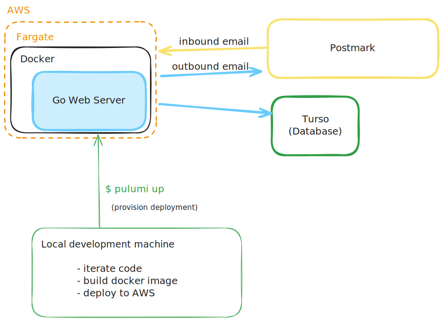

# Dev

First, create your secret `.env` file: `cp env.example .env`, open the file and add the relevant secrets to your env file.
Use `make live` to run a server during development with `--watch` capability.
You may need to run `npm i` and `go mod tidy` to download dependencies.

## Requirements

For the proper functioning of the app, it is necessary to do a few configuration steps with external services first. Namely:

- You need to configure a [Turso](https://turso.tech/) account in order to allow database access to the app, respective env variables need to be set.
- Once the app has access to a database, you need to run the app (`make gen` or `make live`), this will allow you access into a dashboard to the database, provided by the Pocketbase dependency. You can access this dashboard through `localhost:8090/_/`. In here you will create an admin user, which has full access to the dashboard and the data. Then, you should go to the `users` collection in the dashboard and create the user accounts that will be accessed through the app. Take note of their email and password. At this point you should be able to see the `inbound` and `outbound` collections in the dashboard, if you do not see them for whatever reason, you may try laonching the migrations manually with `go run . migrate collections`.
- After you have taken these steps, you may now access through the app's login screen with said email address and password (`localhost:8090/login`).
- However, the app will be empty, in order to receive and send emails, it is required to configure the Email Service Provider. In this case, [ Postmark ](https://postmarkapp.com/).
- In Postmark, you must configure the outbound email stream and the inbound email stream.
  + Outbound email stream: you need to simply copy your tokens into the env file, and you need to verify your address or domain as a sender in Postmark, this may require setting some DNS records. After you do this, you will be able to send emails from the app's UI through the account that you created earlier in the Pocketbase UI. Please note, your Verified Sender Email in Postmark must match the email of your app account that you created in the Pocketbase dashboard.
  + Inbound email: you must register a webhook endpoint through which Postmark can reach your app in order to communicate inbound emails. This may require using a tunneling software to expose your `localhost:8090/api/postmark/inbound` endpoint if you don't have an HTTP endpoint accessible through the internet ([`ngrok`]( https://ngrok.com/) is a simple one, [`frp`]( https://github.com/fatedier/frp ) is a OSS alternative with a higher learning curve).

Congrats, if you did all that, you may now run the app locally with all of its functionality available.

If you want to deploy to the cloud, you will require some additional knowledge to properly configure your virtual network. You may use the IaC in the `/pulumi` directory as reference.

### Notes: 

- For Pulumi the only static ID is the SSL certificate from AWS, adjust this to your needs:
    * in file `pulumi/src/ecs.ts` adjust constant `const CERT_ARN`

- Besides `AWS`, a `postmarkapp.com` and a `turso.tech` account is necessary to fill the configuration.
    * For `postmark`, you need to perform proper configuration of your domain on their dashboard, in order to use the inbound webhook.

# Testing Dockerfile

Use `make dockerbuild` and `make dockerrun` to test the Docker image locally.

# Deploy

First make sure all the assets have been generated in your local machine (Docker will copy them):

`make live` in the root of the project

Deploy with Pulumi:

`cd pulumi && pulumi up`

This will automatically build the Docker image and push it to ECR for the new deployment.

You need to configure your aws cli credentials for Pulumi to authenticate with your AWS account.

# Making the project prod-ready

These are some aspects to take into account if this project were to be deployed in a prod environment.

- Create separate `dev` and `prod` environments.
Right now the same Turso database is accessed in any env, 
a better configuration would use a local database for `dev`.
To do so it would be necessary to add a CI/CD pipeline to handle 
the migrations on the `prod` database.
- Add CSRF protection to the forms, given that the project is using cookie-based authentication.
- Add persistent logs:
    * Currently the info and error logs are persisted to the filesystem, separate from the database provider to offset the load.
    * On a `prod` environment, it would be important to persist the logs in a service like AWS CloudWatch.

# Additional improvements for a long-term project

- Moving away from Fargate and implementing a CI/CD pipeline.
    * Fargate is useful for its simplicity as there is no need to manage Linux resources as there would be with EC2 or Kubernetes.
    * However, Fargate has a very slow deployment process, it may take up to 20 minutes from start to finish.

# Tech Stack

## Infrastructure

- AWS 
    * Cloud provider.
- Docker
    * Containerization.
- [ Pulumi ](https://www.pulumi.com/)
    * This is an IaC solution that can be configured from a variety of programming languages through an SDK.
    * Provides the capacity to use a familiar programming language to configure the AWS services, this allows easy iteration and powerful contructs within the configuration.
    * Controls the provisioning of the AWS resources from scratch, including: VPC (Subnets & Security Groups), ECS, Fargate.
- [ ECS ](https://aws.amazon.com/ecs/)
    * AWS service to orchestrate containers.
    * The parent service to deploy Fargate instances.
    * Allows tight control over the network configuration through AWS VPC, such as:
        + The Subnet assignment to the resources.
        + The Security Groups assigned to the resources.
        + The routing tables within the VPC for its managed resources.
    * Manages a variety of services beyond the Fargate instance, such as:
        + The Internet Gateway to receive internet traffic.
        + The Load Balancer, to route internet traffic to the Fargate instances.
        + In case of private subnets, it manages the NAT Gateway.
        + In case of public subnets, the public IPs (Elastic IPs) for outbound traffic.
- [ Fargate ](https://aws.amazon.com/fargate/)
    * The compute managed by ECS, Fargate is the "managed" version. ECS can also run on self-managed EC2. Fargate abstracts away the maintanance of the EC2 instances.
    * Allow easy deployment of managed Docker containers.
    * For an app that needs to run 24/7, the price point is slightly higher than equivalent EC2 instances, but not by much.
- [ Turso ](https://turso.tech/)
    * This SaaS offers a remote managed SQLite database for a great price. Similar to using RDS, but simpler.
    * Works like a charm with the chosen backend framework chosen for the app, as both are limited to the SQLite database.
- [ Postmark ](https://postmarkapp.com/)
    * This SaaS offers inbound and outbound email delivery through a JSON API, this significantly simplifies email integration in comparison to common email protocols.
- Go programming language
    * The server app is written with Go.

## Reliability and Durability

### Server Reliability

Due to the usage of ECS, the reliability of the app ought to be fairly high, as ECS manages the recreation of the server on a different Availability Zone if the current Availability Zone goes down. The main issue is going to be the downtime that it takes for ECS to redeploy the task. In my experience, this downtime is anywhere between 10 and 30 minutes.

Additionally, a High Availability scheme for the server is not straight-forward to implement as it is and would require additional work. Specifically because the user sessions are stored on the server's memory, so it would be necessary to store the sessions on a durable persistance layer (such as the DB or distributed KV stores) to allow the horizontal scaling of the server across Availability Zones.

### Data Durability

Due to the usage of Turso SaaS for data, the data durability is incredibly high for any single write. All writes to the DB must be persisted to the Turso leader database before they are considered committed on the go server. As a fail-safe measure, periodic database backups may be performed.

## Server app

- Go libraries that power the app:
    * [ Pocketbase ](https://pocketbase.io/)
        + Framework to quickly iterate over the backend, managing many topics out of the box, such as:
            + Manages the database schema.
            + Manages a variety of operations on the database to consume the data.
            + Manages authentication for users and JWT tokens.
            + Manages authorization roles for each user, allowing them to access only their own data.
    * [ Templ ](https://templ.guide/)
        + HTML templating for Go apps. Like JSX but for Go.
    * [ SCS ](https://github.com/alexedwards/scs): Go session manager
        + Cookie-based session management for users navigating on their browser.
        + Follows OWASP guidelines to keep cookies secure.
- Frontend libraries:
    * [ HTMX ](https://htmx.org/)
        + This is a library to perform client-side DOM operations, without writing client-side JavaScript.
        + This allows smooth transitions in the browser while keeping the logic in the server, such as displaying validation messages to the user.
    * [ DaisyUi ](https://daisyui.com/)
        + Great UI library to iterate quickly. Leverages TailwindCSS.

# Feature set

## Priorities when picking the feature-set of the solution

- Full implementation across the tech stack, including proper configuration of the cloud resources.
    * Including DNS and SSL configuration, which is not reflected in the code.
- Proper user authentication.
- Ease of use.
- Meets the requirements of receiving and sending email with an intuitive user experience.
- A balance to make an efficient use of time without cutting corners that ought to be considered cornerstones of online software.
    * Careful decisions when choosing the external dependencies to meet this balance:
        + Simplicity over complexity.
        + Efficient external tools where a hand-written solution provides little benefit.
        + Flexibility and freedom over smothering software dependencies.

# Limitations

Due to simple parsing logic for inbound emails:
- Only inbound emails with a single destination are taken into account.
    * Corollary: Emails directed at multiple accounts might not show up in the inbox.
- Only shows inbound emails with the exact email address, dots `.` and plus signs `+` are not supported.
- Only the following fields are shown in the UI:
    * Subject
    * To
    * From
    * Body in plain text
    * Date (which is not timezone-localized)

With additional time, these limitations would be amended with ease.

Due to time-constraints the user features are kept minimal. Although I would have enjoyed an "outbox" page to look at the sent emails, completing such an additional feature would simply require repeating the steps that were taken for the "inbox".

# Some learnings

## Things that I would have done differently a second time

Using Pocketbase with a go-based ServerSideRendering for the UI is not ideal, as the Pocketbase API is focused on a JavaScript SDK, and misses some of its user functionality when using it as a server framework. For example:
- There is no clear way to handle user auth from the Go code, so I had to come up by trial and error with a proper way to manage the authentication middleware.

Using Pocketbase with Templ is challenging, even though the libraries do their piece of the work really well, putting them together results in rather ugly routing code, as the http function handlers required by Templ have a different idiom/API than the function handlers used by Pocketbase.
- One such example is the usage of `apis.WrapStdHandler(handler)` within the code, it makes the logic a bit more confusing than it has to be.

In short, if I had to find a way to build another similar project, I would pick Pocketbase for the backend and an SPA framework for the frontend, as it would be much easier to work on.
